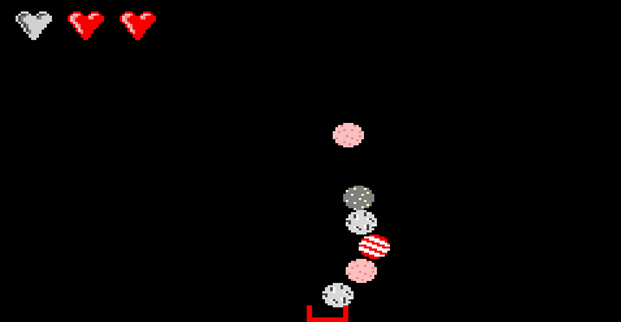
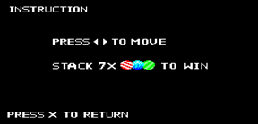

# gba-catch-me

 Download your own GameBoy Advance game: Catch falling ice cream and complete all 4 levels! 

<h2> Requisites </h2>
	<li> GBA Emulator (e.g. Visual Boy Advance Emulator) </li>
  <li> (optional) IDE (e.g. HAM) and  to edit game logic </li>
<h2> Files </h2>
	<li> catchme.gba: to be opened in emulator </li>
  <li> catchme_ws: Contains main.cpp, header files, and HAM project </li>
<h2> Instructions </h2>
	<li> To play the game, open the .gba file in Visual Boy Advance  </li>
  <li> For developers: Most game logic can be found and edited in main.cpp and additional header files can be included for more functionalities </li>
<h2> Some Screenshots! </h2>

 
 
 

 <em>(this game was developed in HAM in C as part of ME3241 Microprocessor Applications module in NUS) </em> 

